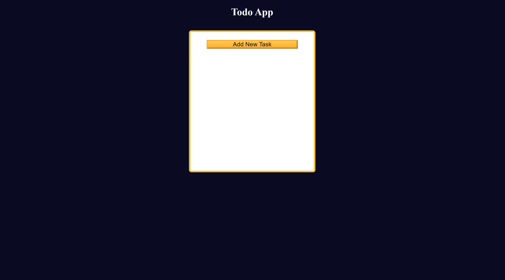

# TODO App Solution

This is a solution to the [Learn localStorage by Building a Todo App challenge on FreeCodeCamp](https://www.freecodecamp.org/learn/javascript-algorithms-and-data-structures-v8/learn-localstorage-by-building-a-todo-app/step-1). This challenge helps you understand how to use `localStorage` to persist data in a web application.

## Table of contents

- [Overview](#overview)
  - [The challenge](#the-challenge)
  - [Screenshot](#screenshot)
  - [Links](#links)
- [My process](#my-process)
  - [Built with](#built-with)
  - [What I learned](#what-i-learned)
  - [Continued development](#continued-development)
  - [Useful resources](#useful-resources)
- [Author](#author)
- [Acknowledgments](#acknowledgments)

## Overview

### The challenge

Users should be able to:

- Add new tasks with a title, date, and description
- View a list of added tasks
- Edit existing tasks
- Delete tasks
- The data should persist even after a page reload using `localStorage`

### Screenshot



### Links

- Live Site URL: [Live Site](https://codepen.io/Yashi-Singh/pen/VwJbxOB)

## My process

### Built with

- Semantic HTML5 markup
- CSS custom properties
- Flexbox
- JavaScript (ES6)
- `localStorage`

### What I learned

Working on this project reinforced my understanding of:

- **`localStorage`**: How to store and retrieve data in a web application.
- **JavaScript DOM Manipulation**: How to dynamically create, update, and remove elements.
- **Event Handling**: Managing form submissions, button clicks, and dialog interactions.
- **Conditional Logic**: Handling unsaved changes and confirming user actions with dialogs.

Code snippets I’m proud of:

```javascript
const addOrUpdateTask = () => {
  const dataArrIndex = taskData.findIndex((item) => item.id === currentTask.id);
  const taskObj = {
    id: `${titleInput.value.toLowerCase().split(" ").join("-")}-${Date.now()}`,
    title: titleInput.value,
    date: dateInput.value,
    description: descriptionInput.value,
  };

  if (dataArrIndex === -1) {
    taskData.unshift(taskObj);
  } else {
    taskData[dataArrIndex] = taskObj;
  }

  localStorage.setItem("data", JSON.stringify(taskData));
  updateTaskContainer();
  reset();
};
```

```css
.task-form {
  display: flex;
  position: absolute;
  top: 50%;
  left: 50%;
  transform: translate(-50%, -50%);
  background-color: var(--white);
  border-radius: 5px;
  padding: 15px;
  width: 300px;
  height: 350px;
  flex-direction: column;
  justify-content: space-between;
  overflow: auto;
}
```

```javascript
const editTask = (buttonEl) => {
    const dataArrIndex = taskData.findIndex(
    (item) => item.id === buttonEl.parentElement.id
  );

  currentTask = taskData[dataArrIndex];

  titleInput.value = currentTask.title;
  dateInput.value = currentTask.date;
  descriptionInput.value = currentTask.description;

  addOrUpdateTaskBtn.innerText = "Update Task";

  taskForm.classList.toggle("hidden");  
}
```

### Continued development

In future projects, I aim to:

- **Implement Advanced Features**: Adding task prioritization, categories, or tags.
- **Explore More Storage Options**: Such as session storage or IndexedDB for more complex scenarios.
- **Improve UI/UX**: Enhancing the form with better validation and user feedback.

### Useful resources

- [MDN Web Docs - `localStorage`](https://developer.mozilla.org/en-US/docs/Web/API/Window/localStorage) - Essential for understanding how to use local storage.
- [JavaScript.info - DOM Manipulation](https://javascript.info/dom-nodes) - Great resource for learning about JavaScript and DOM manipulation.
- [CSS Tricks - Flexbox Guide](https://css-tricks.com/snippets/css/a-guide-to-flexbox/) - Helpful for layout design using Flexbox.

## Author

- LinkedIn - [Yashi Singh](www.linkedin.com/in/yashi-singh-b4143a246)

## Acknowledgments

A special thank you to FreeCodeCamp for providing this challenge. It was a great opportunity to practice JavaScript and understand `localStorage`. Also, thanks to the community for their support and feedback. Lastly, a shout-out to [MDN Web Docs](https://developer.mozilla.org) for their comprehensive documentation and tutorials.